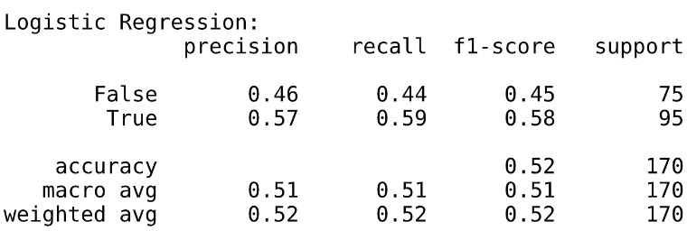
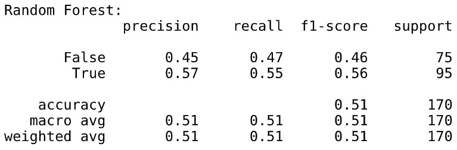
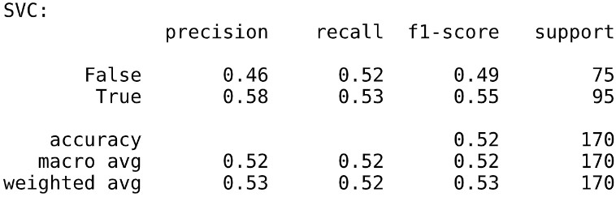
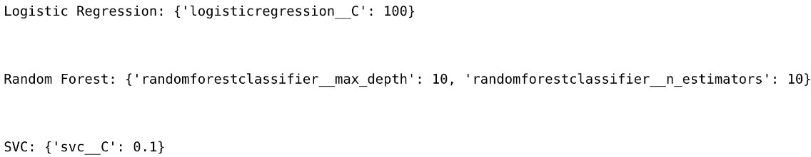
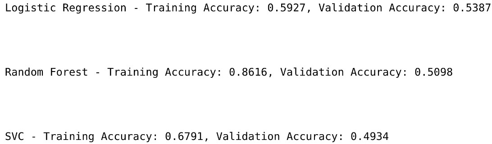
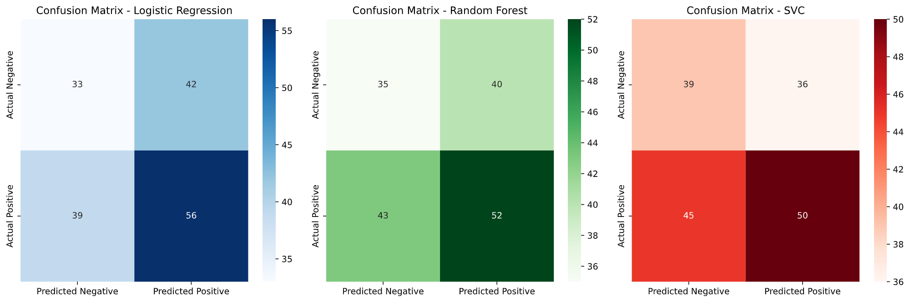

# Sports Prediction Project - ENSF 444
### By Evan Mann and Keeryn Johnson

## Overview
This project is based off the NHL playoff dataset from [Hockey References](https://www.hockey-reference.com/), which ranges from 2005 - 2025. This program predicts the wins and losses of the playoffs for all current NHL teams based on data such as games played, overall points achieved, goals, assists, and much more. 
Using various models, including Logistic Regression, Random Forest and Support Vector Classifier (SVC), the system processes the data based on the dataset, scales the data, gathers the best hyperparameters using grid searches, and finally makes its predictions and saves the models
performance data.

The goal of this project is to assess model performance and generate an easily understandable PDF report that includes:
- Classification reports
- Model training and validation accuracy scores
- Best hyperparameters found for each model
- Confusion matrices

## Installation

### Requirements
Ensure you have Python 3.7 or higher installed along with the following libraries:
- `numpy`
- `pandas`
- `seaborn`
- `matplotlib`
- `scikit-learn`

You can install the required libraries by running:

```bash
pip install numpy pandas seaborn matplotlib scikit-learn
```

### How To Use
Simply run the [Analyzer.py](./Analyzer.py) file, and wait for the dataset prediction report to be created!

## Results
The results of the models and their outcomes can be found in the [Classification Report](./classification_reports.pdf). They are also listed below:
### Classification Reports
  
  
  

### Best Parameters  
  

### Model Scores  
  

### Confusion Matrices  



